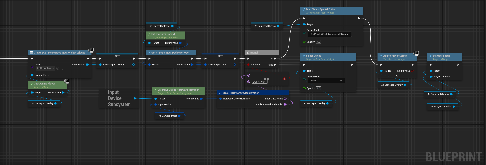
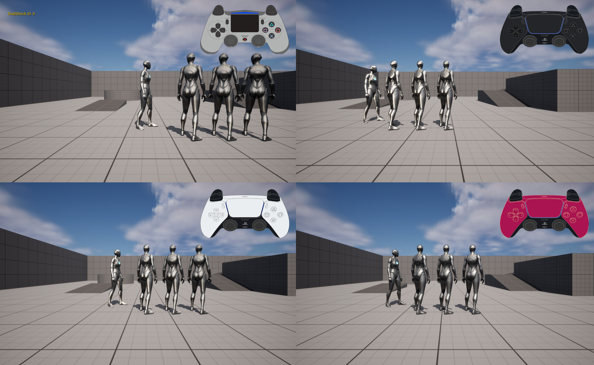

# DualSense Overlay Widget for Unreal Engine 5.2 ~ 5.6

The **DualSenseOnScreenOverlay** is a versatile and customizable widget for Unreal Engine, designed to seamlessly adapt to various screen sizes and resolutions.

It offers extensive compatibility with multiple DualSense controller models, providing flexible options to enhance integration and user interaction. 

This widget is ideal for developers looking to implement responsive and dynamic overlays with DualSense support directly within Unreal Engine projects.

> **Note:** No need to configure the buttons; they are already mapped to the default gamepad layout.
>
> You can also use the [ Windows Dualsense Unreal ](https://github.com/rafaelvaloto/WindowsDualsenseUnreal) plugin for Unreal for better compatibility

### [Links for installation](#Install-on-FAB-official-page-plugin-)

### Visual Blueprint Example
- Below is a typical example of Blueprint usage:
   - **Create Widget:** Instantiate the overlay widget.
   - **Set Device Type:** Choose between DualShock or DualSense as needed.
   - **Add to Viewport:** Display the overlay on screen.

---

DualShock 4 or DualSense 

[Watch the Example Video](https://1drv.ms/v/c/6c07d40187e87b76/EV9sGl0t6-VAnsWXfITYcnEBAJ1vPWZ-L0HXnCdFjkWUzg)

# Install on FAB official page plugin 

To install this plugin directly via FAB (Official Source), follow the steps below:

1. **Access the plugin's official page on FAB**  
   Go to the official plugin page [by clicking here](https://fab.com/s/3892fa15cfa1).

3. **Install the Plugin**
   - On the plugin page, click the **Install** or **Add to Project** button (depending on the FAB interface).
   - Choose your Unreal Engine project where the plugin will be used, or simply download it for manual setup.

4. **Configure in Unreal Engine**
   - Open your project in Unreal Engine.
   - Go to the **Plugins** tab under `Edit > Plugins`.
   - Search for `Windows DualSense Plugin` in the list and enable it if necessary.
   - Restart the project to apply the changes.

## Contributions
Thanks to,
[Gamepad-Asset-Pack](https://github.com/AL2009man/Gamepad-Asset-Pack) for their valuable assets.
