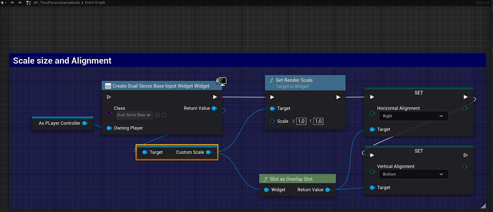
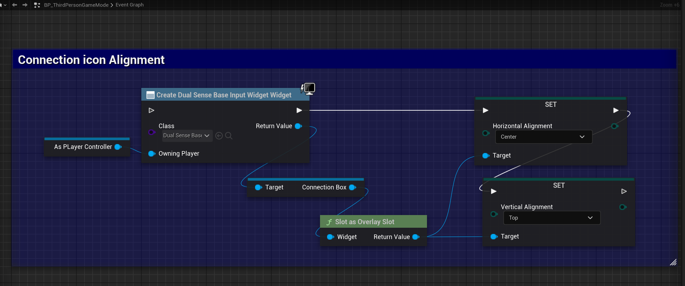

# DualSense & DualShock Overlay Widget for Unreal Engine 5.2 ~ 5.6

**DualSenseOnScreenOverlay** is a versatile and highly customizable widget for Unreal Engine, designed to adapt seamlessly to any screen size or resolution.

A key feature of this widget is its comprehensive support for different controller models: **DualSense** (including DualSense Edge) and **DualShock 4**. You can easily switch between models, and the overlay visuals—including the connection icon (USB/Bluetooth)—are carefully aligned and flexible to fit the interface of your project. This ensures accurate displays and consistent UI integration whether you're showing DualSense or DualShock controllers.

Perfect for developers seeking dynamic and responsive controller overlays, with special attention to authentic representation and alignment for DualSense and DualShock devices in Unreal Engine projects.

> **Note:** Button mapping is automatic and uses the default controller layout, so you don't need to configure it yourself.
>
> For enhanced compatibility on Windows, you can also use the [Windows Dualsense Unreal](https://github.com/rafaelvaloto/WindowsDualsenseUnreal) plugin.

---

### Visual Usage Examples

- **DualSense, DualSense Edge, and DualShock 4 support** — seamlessly toggle between controller models.
- **Overlay and connection icon alignment** — keep every element visually consistent.
- **Opacity and position adjustments** — easily customize to fit your game UI.

### [Links for installation](#Install-on-FAB-official-page-plugin-)

### Visual Blueprint Example
- Below is a typical example of Blueprint usage:
   - **Create Widget:** Instantiate the overlay widget.
   - **Set Device Type:** Choose between DualShock or DualSense as needed.
   - **Add to Viewport:** Display the overlay on screen.

---

DualShock 4 or DualSense 

Opacity and position alignment

Connection Type Icon

[Watch the Example Video](https://youtu.be/V-Tq0wigsFI)

# Install on FAB official page plugin 

To install this plugin directly via FAB (Official Source), follow the steps below:

1. **Access the plugin's official page on FAB**  
   Go to the official plugin page [by clicking here](https://fab.com/s/3892fa15cfa1).

3. **Install the Plugin**
   - On the plugin page, click the **Install** or **Add to Project** button (depending on the FAB interface).
   - Choose your Unreal Engine project where the plugin will be used, or simply download it for manual setup.

4. **Configure in Unreal Engine**
   - Open your project in Unreal Engine.
   - Go to the **Plugins** tab under `Edit > Plugins`.
   - Search for `Windows DualSense Plugin` in the list and enable it if necessary.
   - Restart the project to apply the changes.

## Contributions
Thanks to,
[Gamepad-Asset-Pack](https://github.com/AL2009man/Gamepad-Asset-Pack) for their valuable assets.
